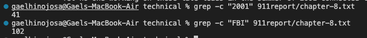

# Lab Report 3

## Command: Grep

First example: **grep -w**

Grep -w is useful for finding specific words in a text, has to match exactly though


Input
```
grep -w "Boarding the Flights" 911report/chapter-1.txt
```
Output
```
Boarding the Flights
```


Input
```
grep -w "understood the gravity" 911report/chapter-11.txt
```
Ouput
```
If the government's leaders understood the gravity of the threat they faced and
```


Second Example: **grep-c**

Grep -c is useful for counting how many lines there are that contain a certain piece of text



Input
```
grep -c "2001" 911report/chapter-8.txt
```
Output
```
41
```

Input
```
grep -c "FBI" 911report/chapter-8.txt
```
Output
```
102
```


Third Example: **grep --color**

Grep --color is useful for finding words easier in a large body of text


Input
```
grep --color "Martin Marty" 911report/chapter-13.3.txt
```
Output
```
7. See Martin Marty and R. Scott Appleby, eds., Fundamentalism Observed, vol. 1
```

Input
```
grep --color "United States" 911report/chapter-13.3.txt
```
Output
```
Statements, United States v. Enaam Arnaout, No. 02-CR-892 (N.D. Ill. filed Jan. 6,
                mujahideen were financed (even "one penny") or trained by the United States. See
                United States v. Arnaout, Jan. 6, 2003. See also Intelligence report, Terrorism:
                Statements, United States v. Arnaout, Jan. 6, 2003.
```


Fourth Example: **grep -i**

Grep -i would be useful for igonring case distinctions in both the pattern and the input files


Input
```
grep -i "CARLO" government/Alcohol_Problems/Session3-PDF.txt
```
Output
```
Carlo C. DiClemente, PhD* Carl Soderstrom, MD
Response to Dr. Carlo DiClemente's Presentation
Carlo DiClemente said the message needs to be reinforced after
```


Input
```
grep -i "laRrY" government/Alcohol_Problems/Session4-PDF.txt
```
Output
```
Larry M. Gentilello, MD
Response to Dr. Larry Gentilello's Presentation
Jeffrey Runge agreed with Larry Gentilello that health
```


For all of the different command-line options for grep, I used ChatGPT to help me further understand what each of them did
[ChatGPT](https://chat.openai.com/)
